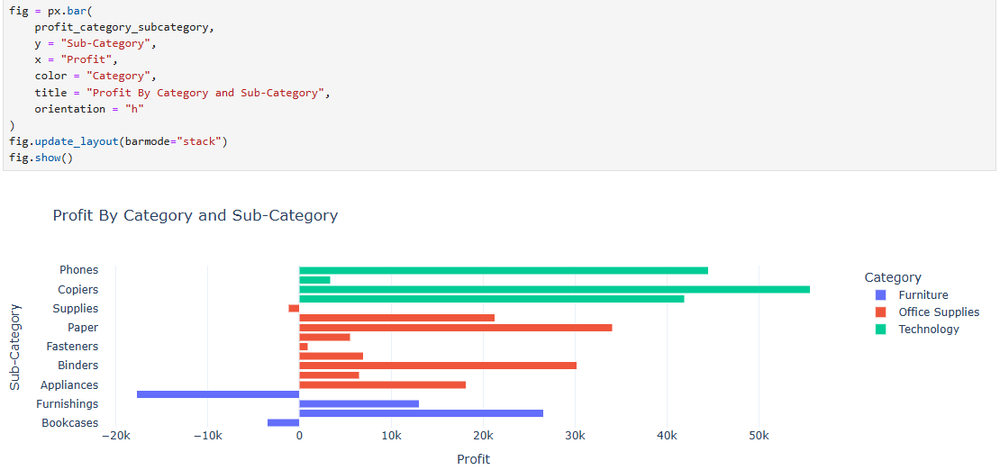
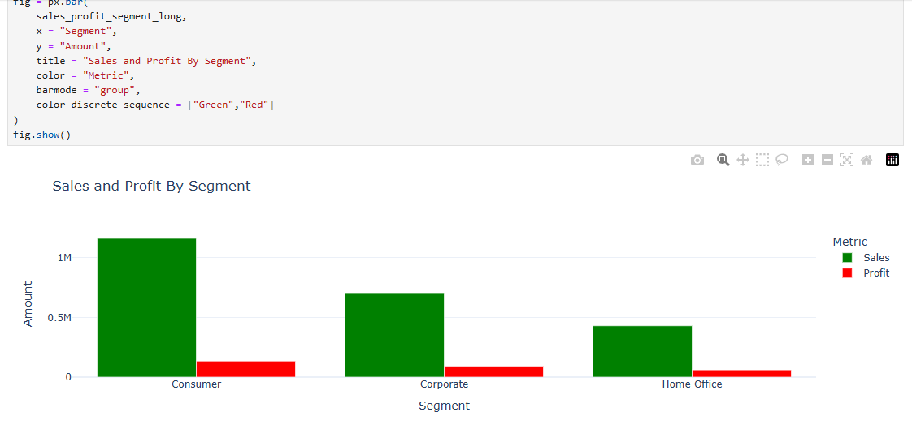
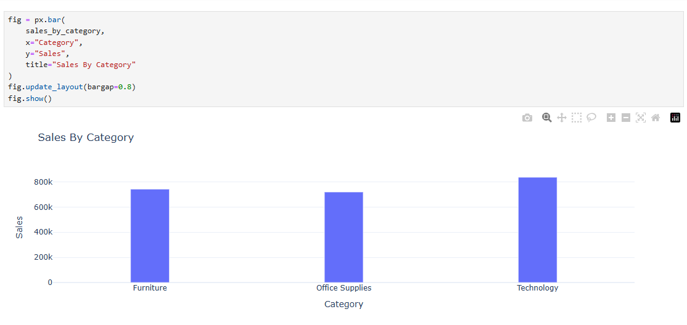
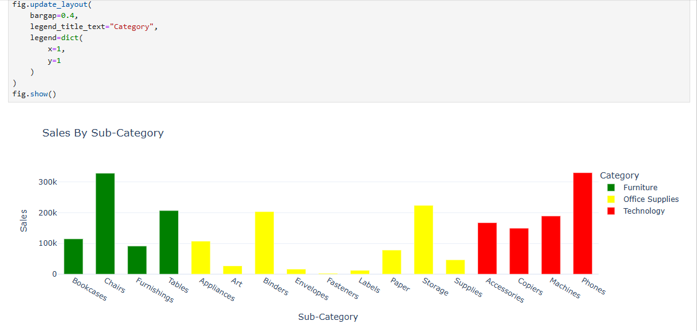
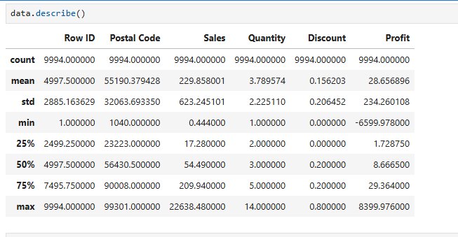

# 📊 Superstore Sales Analysis Project

In this project, I analyzed the sales data of a fictional superstore to uncover trends, generate actionable business insights, and create data visualizations to support decision-making.

## 🎯 Project Objective

The objective of this project is to perform **data cleaning**, **analysis**, and **visualization** on the *Superstore Dataset* to:

- Understand **monthly sales and profit trends**
- Identify **top-performing categories and sub-categories**
- Analyze **sales-to-profit ratio** for better business decisions

## 📂 Dataset Used

- **Name**: *Sample - Superstore Dataset*
- **Records**: 9,994 entries
- **Attributes**: Customer, Order, Product, Sales, Profit, Shipping
- **Source**:  <a href="https://github.com/VikasSharma0052/Superstore-Sales-Analysis/blob/main/Sample%20-%20Superstore.csv">Provided dataset file</a>

## ❓ Key Questions (KPIs)

1. 📅 What are the **monthly trends** in sales and profit?
2. 🏬 Which **categories** and **sub-categories** have the highest sales and profits?
3. 📈 What is the **sales to profit ratio** for different segments?

## ⚙️ Process Followed

1. 🔄 **Data Cleaning**:
   - Converted `'Order Date'` and `'Ship Date'` to datetime format.
     
3. 🏷️ **Feature Engineering**:
   - Added new columns for:
     - **Month**
     - **Year**
     - **Week**
       
4. 📊 **Analysis Performed**:
   - Monthly Sales Analysis ✅ 
   - Sales by Category ✅ 
   - Sales by Sub-Category ✅ 
   - Monthly Profit Analysis ✅ 
   - Profit by Category and Sub-Category ✅ 
   - Sales and Profit by Segment ✅
   - Sales to Profit Ratio ✅
  
5. 📈 **Visualization**:

   Created using **Plotly**

## 📸 Visualizations

### 1️⃣ Profit by Category and Sub-Category

### 2️⃣ Sales by Category

### 3️⃣ Sales by Category

### 4️⃣ Sales by Sub-Category

### 5️⃣ Statistical Data.

## 🧠 Project Insights

1. 📅 Monthly Sales: Sales are highest in November with ₹352.46K.

2. 🏷️ Sales by Category: The Technology category leads with ₹836.15K in sales.

3. 🏷️ Sales by Sub-Category:
   
   - 🪑 Chairs: ₹328.44K (Furniture)
   - 📦 Storage: ₹223.84K (Office Supplies)
   - 📱 Phones: ₹330K (Technology)

4. 💰 Monthly Profit: The highest monthly profit is in December with ₹43.36K.

5. 🏆 Profit by Category & Sub-Category:

   - 🖨️ Copiers (Technology): ₹55.61K

   - 📄 Paper (Office Supplies): ₹34K

   - 🪑 Chairs (Furniture): ₹26K

   - ⚠️ Tables (Furniture) show a loss of ₹-17.72K.

6. 👥 Sales and Profit by Segment:

   - Consumer segment dominates with ₹1.16M in sales and ₹134.11K in profit.

7. 📊 Sales to Profit Ratio: Highest ratio is 8.65 for the Consumer segment.

## ✅ Final Conclusion :

The analysis highlights November as the peak month for sales, with Technology products, especially Phones and Copiers, contributing the most to revenue and profits. Furniture Tables show consistent losses, requiring review of pricing or discount strategies. The Consumer segment emerges as the most profitable, making it ideal for focused marketing and loyalty programs. To grow the business, the company should leverage seasonal promotions, optimize inventory in high-profit categories, and reduce losses from underperforming products. Strategic focus on high-margin segments and data-driven marketing can drive sustainable profitability.
